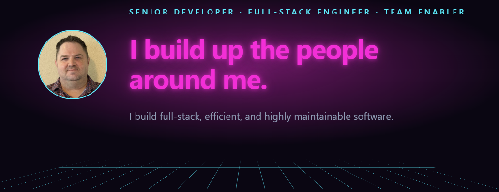

# my-personal-site

Aaron Tilley's personal site — about/resume, a blog, a board game collection backed by Notion, and a minerals & fossils catalog backed by Postgres. Built as a client-side React SPA with prerendered meta tags for link previews, deployed on Vercel.

Live at [aarontilley.me](https://aarontilley.me).



## Architecture decisions

Each data source uses the strategy that fits how often it changes and where it lives.

- **Board games: live Notion API with a snapshot fallback.** `api/games.ts` reads Notion on each request behind a short edge cache, so edits show up without a redeploy. If that call fails, the page falls back to a checked-in snapshot (`npm run fetch:games`), so it never breaks.
- **Minerals & fossils: Neon Postgres.** The database is hosted through Vercel alongside the site itself, and it shows a different way of storing and retrieving data than the Notion-backed board games. `api/fossils.ts` queries the catalog table on each request behind a short edge cache, and the schema is versioned in `db/migrations`.
- **Books: live Hardcover GraphQL, no build step or database.** `api/books.ts` and `api/currently-reading.ts` query Hardcover on each request behind a short edge cache, so a newly finished or starred book appears without a redeploy or manual sync.
- **Blog: markdown files, with one parser shared by the site and the RSS feed.** Posts live in `content/blog` and are parsed by `src/lib/blog.ts`. `scripts/generate-rss.mjs` builds `public/rss.xml` from that same module (loaded through Vite's SSR loader, since `blog.ts` reads posts via `import.meta.glob`), so the feed can't drift from what's rendered on the blog.
- **Meta tag prerendering for link previews.** Link-preview crawlers don't run JavaScript, so after `vite build`, `scripts/prerender-meta.mjs` writes a static HTML page for every route and blog post with its title, OpenGraph/Twitter tags, and canonical link baked in. Any other path falls back to the SPA shell (`app-shell.html`) via `vercel.json`.

## How I build

This site is developed with [Claude Code](https://claude.com/claude-code) in VS Code. Multi-part tasks go through an orchestrator agent (`.claude/agents/orchestrator.md`) that delegates to specialized agents in `.claude/agents/`, and a custom `synthwave-ui` design skill (`.claude/skills/synthwave-ui/SKILL.md`) keeps styling consistent across pages.

I generate a thorough prompt that is specific and has details, but allows the orchestrator and subagents leeway to implement.

## Tech stack

- **Framework:** React 19 + [TanStack Router](https://tanstack.com/router) (file-based routes in `src/routes`), built with Vite
- **Styling:** Tailwind CSS v4, [shadcn](https://ui.shadcn.com/)-based components
- **Data:**
  - Board games sourced from a Notion database (`api/games.ts`, `scripts/fetch-games.mjs`)
  - Minerals & fossils catalog in Neon Postgres (`api/fossils.ts`, `db/migrations`)
  - Books from the Hardcover GraphQL API (`api/books.ts`, `api/currently-reading.ts`)
  - Blog posts as markdown files in `content/blog`
- **Hosting:** Vercel (serverless functions in `api/`, static SPA otherwise)
- **Testing:** Vitest

## Prerequisites

- Node.js `^20.19.0` or `>=22.12.0` (Vite's requirement); developed on `v20.19.0`
- npm (bundled with Node)

## Getting started

```bash
npm install
cp .env.example .env.local
```

Fill in `.env.local` with real values — see [Environment variables](#environment-variables) below. Then:

```bash
npm run dev
```

This starts the Vite dev server (default `http://localhost:5173`).

## Environment variables

Copy `.env.example` to `.env.local` (already gitignored) and fill in:

| Variable | Used by | Notes |
| --- | --- | --- |
| `NOTION_TOKEN` | `scripts/fetch-games.mjs`, `api/games.ts` | Notion integration token for the board games database. Only read server-side; it never reaches client code |
| `NOTION_DATABASE_ID` | `scripts/fetch-games.mjs`, `api/games.ts` | ID of the Notion database holding the board game collection |
| `NOTION_DATA_SOURCE_ID` | `api/games.ts` | Notion data source ID |
| `DATABASE_URL` | `scripts/migrate.mjs`, `api/fossils.ts` | Neon Postgres connection string. In production this is auto-injected by the Vercel Marketplace Neon integration |
| `HARDCOVER_API_TOKEN` | `api/books.ts`, `api/currently-reading.ts` | Hardcover Personal Access Token. Expires after 1 year with no programmatic renewal — regenerate manually at hardcover.app account settings when it does |
| `HARDCOVER_USER_ID` | `api/books.ts`, `api/currently-reading.ts` | Numeric Hardcover user ID (not a secret) — get it by querying `{ me { id } }` against the Hardcover API with your token |

These same variables must also be set in the Vercel dashboard for the deployed `api/*.ts` functions to work. Never commit real values — `.env.local` is gitignored.

## Available scripts

| Command | Description |
| --- | --- |
| `npm run dev` | Start the Vite dev server with HMR |
| `npm run build` | Run tests, typecheck, generate the RSS feed, build the production bundle, then prerender per-route meta tags |
| `npm run preview` | Serve the production build locally |
| `npm run lint` | Run ESLint |
| `npm test` | Run the Vitest test suite once |
| `npm run fetch:games` | Pull the board game collection from Notion into `src/data/board-games.json`, the fallback snapshot used when `/api/games` is unavailable (run manually, not part of `build`; requires `NOTION_TOKEN`/`NOTION_DATABASE_ID`) |
| `npm run db:migrate` | Apply every `.sql` file in `db/migrations`, in filename order, against `DATABASE_URL` |

## Project structure

```
.claude/          Claude Code agents and the synthwave-ui design skill
api/              Vercel serverless functions: games, fossils, books, currently-reading
                  (_*.test.ts files are tests; the _ prefix keeps Vercel from deploying them)
content/blog/     Blog posts as markdown
db/migrations/    SQL migrations for the minerals & fossils Postgres table
docs/             Design specs, implementation plans, and the README screenshot
public/           Static assets (blog images, headshot, OG image), generated rss.xml
scripts/          Build-time Node scripts (Notion fetch, DB migrate, RSS, meta prerender)
src/
  assets/         Images imported by components
  components/     UI components (incl. about/, blog/, books/, contact/, fossils/, games/, home/, resume/ subfolders)
    ui/           shadcn UI primitives (button, card, dialog, etc.), imported as @/components/ui/...
  data/           Board game fallback snapshot (board-games.json)
  hooks/          React hooks
  lib/            Shared logic (blog parsing, resume data and PDF generation, meta tags, etc.)
  routes/         TanStack Router file-based routes
  types/          Shared TypeScript types
  router.ts       Router setup; routeTree.gen.ts beside it is generated by the router plugin
```

## Testing

```bash
npm test
```

Vitest runs in a Node environment (see `vitest.config.ts`), and `npm run build` runs the suite first, so a failing test stops the build. Tests cover:

- Blog parsing (`src/lib/blog.test.ts`) and image handling (`src/lib/image.test.ts`)
- Resume PDF layout (`src/lib/generate-resume-pdf.test.ts`) and the About timeline built from resume data (`src/lib/journey.test.ts`)
- Blog, book, and game filters, book stats, and the game picker's spin animation (`src/components/*/*.test.ts`)
- Per-route meta wiring (`src/routes/routeMeta.test.ts`)
- The Hardcover API handlers (`api/_books.test.ts`, `api/_currently-reading.test.ts`)

## Deployment

The site deploys to Vercel. `npm run build` is the build command Vercel runs; it produces a static `dist/` output plus the prerendered per-route HTML, and `api/*.ts` files deploy as serverless functions. Ensure the environment variables above are set in the Vercel project settings before deploying.
